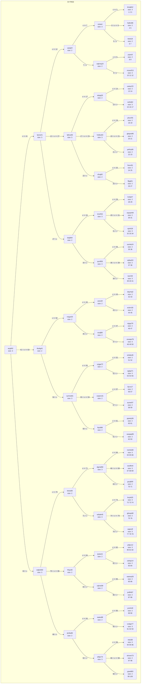
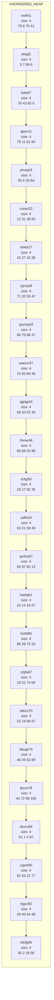

```mermaid
graph TD
subgraph B+TREE
acpjf42[acpjf42<br/>size: 3<br/>]
kjrzw21[kjrzw21<br/>size: 3<br/>]
upsjj10[upsjj10<br/>size: 2<br/>]
viotw4[viotw4<br/>size: 3<br/>]
bmqbh2[bmqbh2<br/>size: 3<br/>1 2 3 ]
viotw4-->|x <= 3|bmqbh2
hafen86[hafen86<br/>size: 2<br/>4 5 ]
viotw4-->|3 < x <= 5|hafen86
ttrek18[ttrek18<br/>size: 2<br/>6 7 ]
viotw4-->|5 < x|ttrek18
upsjj10-->|x <= 7|viotw4
oqkmq19[oqkmq19<br/>size: 2<br/>]
yrpsc6[yrpsc6<br/>size: 2<br/>8 9 ]
oqkmq19-->|x <= 9|yrpsc6
mzwzf13[mzwzf13<br/>size: 3<br/>10 11 12 ]
oqkmq19-->|9 < x|mzwzf13
upsjj10-->|7 < x|oqkmq19
kjrzw21-->|x <= 12|upsjj10
bjhca36[bjhca36<br/>size: 3<br/>]
xbojq25[xbojq25<br/>size: 2<br/>]
uweyr23[uweyr23<br/>size: 2<br/>13 14 ]
xbojq25-->|x <= 14|uweyr23
vwhrj62[vwhrj62<br/>size: 3<br/>15 16 17 ]
xbojq25-->|14 < x|vwhrj62
bjhca36-->|x <= 17|xbojq25
hxbku63[hxbku63<br/>size: 3<br/>]
yksxr55[yksxr55<br/>size: 2<br/>18 19 ]
hxbku63-->|x <= 19|yksxr55
gbqow96[gbqow96<br/>size: 2<br/>20 21 ]
hxbku63-->|19 < x <= 21|gbqow96
yehhy66[yehhy66<br/>size: 2<br/>22 23 ]
hxbku63-->|21 < x|yehhy66
bjhca36-->|17 < x <= 23|hxbku63
vfxaj92[vfxaj92<br/>size: 2<br/>]
frexv91[frexv91<br/>size: 2<br/>24 25 ]
vfxaj92-->|x <= 25|frexv91
ffpgi51[ffpgi51<br/>size: 2<br/>26 27 ]
vfxaj92-->|25 < x|ffpgi51
bjhca36-->|23 < x|vfxaj92
kjrzw21-->|12 < x <= 27|bjhca36
balpl64[balpl64<br/>size: 2<br/>]
tmxfr52[tmxfr52<br/>size: 3<br/>]
lnzfp47[lnzfp47<br/>size: 2<br/>28 29 ]
tmxfr52-->|x <= 29|lnzfp47
oqxqm94[oqxqm94<br/>size: 2<br/>30 31 ]
tmxfr52-->|29 < x <= 31|oqxqm94
ejnih29[ejnih29<br/>size: 3<br/>32 33 34 ]
tmxfr52-->|31 < x|ejnih29
balpl64-->|x <= 34|tmxfr52
qvrdf35[qvrdf35<br/>size: 3<br/>]
ssmlw24[ssmlw24<br/>size: 2<br/>35 36 ]
qvrdf35-->|x <= 36|ssmlw24
vqfwy53[vqfwy53<br/>size: 2<br/>37 38 ]
qvrdf35-->|36 < x <= 38|vqfwy53
iwzri34[iwzri34<br/>size: 3<br/>39 40 41 ]
qvrdf35-->|38 < x|iwzri34
balpl64-->|34 < x|qvrdf35
kjrzw21-->|27 < x|balpl64
acpjf42-->|x <= 41|kjrzw21
ibubg41[ibubg41<br/>size: 2<br/>]
roqye20[roqye20<br/>size: 2<br/>]
uwcsi9[uwcsi9<br/>size: 2<br/>]
daymq3[daymq3<br/>size: 2<br/>42 43 ]
uwcsi9-->|x <= 43|daymq3
ecbrn30[ecbrn30<br/>size: 2<br/>44 45 ]
uwcsi9-->|43 < x|ecbrn30
roqye20-->|x <= 45|uwcsi9
voulj80[voulj80<br/>size: 2<br/>]
xtgsp79[xtgsp79<br/>size: 2<br/>46 47 ]
voulj80-->|x <= 47|xtgsp79
evwqw76[evwqw76<br/>size: 3<br/>48 49 50 ]
voulj80-->|47 < x|evwqw76
roqye20-->|45 < x|voulj80
ibubg41-->|x <= 50|roqye20
rymme81[rymme81<br/>size: 3<br/>]
yrgga72[yrgga72<br/>size: 2<br/>]
enkdy46[enkdy46<br/>size: 2<br/>51 52 ]
yrgga72-->|x <= 52|enkdy46
xgtqa71[xgtqa71<br/>size: 3<br/>53 54 55 ]
yrgga72-->|52 < x|xgtqa71
rymme81-->|x <= 55|yrgga72
xoqmx31[xoqmx31<br/>size: 2<br/>]
fjcvo17[fjcvo17<br/>size: 2<br/>56 57 ]
xoqmx31-->|x <= 57|fjcvo17
auner97[auner97<br/>size: 2<br/>58 59 ]
xoqmx31-->|57 < x|auner97
rymme81-->|55 < x <= 59|xoqmx31
lbyid98[lbyid98<br/>size: 2<br/>]
ppwky56[ppwky56<br/>size: 2<br/>60 61 ]
lbyid98-->|x <= 61|ppwky56
wwqep85[wwqep85<br/>size: 2<br/>62 63 ]
lbyid98-->|61 < x|wwqep85
rymme81-->|59 < x|lbyid98
ibubg41-->|50 < x|rymme81
acpjf42-->|41 < x <= 63|ibubg41
wqbsh82[wqbsh82<br/>size: 3<br/>]
keiss60[keiss60<br/>size: 2<br/>]
dgmid59[dgmid59<br/>size: 3<br/>]
nomlu58[nomlu58<br/>size: 3<br/>64 65 66 ]
dgmid59-->|x <= 66|nomlu58
xwofk44[xwofk44<br/>size: 3<br/>67 68 69 ]
dgmid59-->|66 < x <= 69|xwofk44
gxujk69[gxujk69<br/>size: 2<br/>70 71 ]
dgmid59-->|69 < x|gxujk69
keiss60-->|x <= 71|dgmid59
wfade45[wfade45<br/>size: 3<br/>]
bxyla33[bxyla33<br/>size: 3<br/>72 73 74 ]
wfade45-->|x <= 74|bxyla33
gbxqu68[gbxqu68<br/>size: 2<br/>75 76 ]
wfade45-->|74 < x <= 76|gbxqu68
aapsz8[aapsz8<br/>size: 3<br/>77 78 79 ]
wfade45-->|76 < x|aapsz8
keiss60-->|71 < x|wfade45
wqbsh82-->|x <= 79|keiss60
hfzjz40[hfzjz40<br/>size: 2<br/>]
jkole15[jkole15<br/>size: 2<br/>]
ydipv12[ydipv12<br/>size: 3<br/>80 81 82 ]
jkole15-->|x <= 82|ydipv12
zahqs14[zahqs14<br/>size: 2<br/>83 84 ]
jkole15-->|82 < x|zahqs14
hfzjz40-->|x <= 84|jkole15
zqhxd39[zqhxd39<br/>size: 2<br/>]
eaewa26[eaewa26<br/>size: 2<br/>85 86 ]
zqhxd39-->|x <= 86|eaewa26
pvlbh87[pvlbh87<br/>size: 2<br/>87 88 ]
zqhxd39-->|86 < x|pvlbh87
hfzjz40-->|84 < x|zqhxd39
wqbsh82-->|79 < x <= 88|hfzjz40
jtmfw89[jtmfw89<br/>size: 2<br/>]
saatu88[saatu88<br/>size: 2<br/>]
yoxfx49[yoxfx49<br/>size: 2<br/>89 90 ]
saatu88-->|x <= 90|yoxfx49
vndqe77[vndqe77<br/>size: 3<br/>91 92 93 ]
saatu88-->|90 < x|vndqe77
jtmfw89-->|x <= 93|saatu88
wfqtv74[wfqtv74<br/>size: 3<br/>]
ntioi38[ntioi38<br/>size: 3<br/>94 95 96 ]
wfqtv74-->|x <= 96|ntioi38
ehvwn73[ehvwn73<br/>size: 2<br/>97 98 ]
wfqtv74-->|96 < x <= 98|ehvwn73
ypwdi83[ypwdi83<br/>size: 2<br/>99 100 ]
wfqtv74-->|98 < x|ypwdi83
jtmfw89-->|93 < x|wfqtv74
wqbsh82-->|88 < x|jtmfw89
acpjf42-->|63 < x|wqbsh82
end
```

```mermaid
graph LR
subgraph UNORDERED_HEAP
nwlrb1[nwlrb1<br/>size: 4<br/>79 8 75 41 ]
afogi5[afogi5<br/>size: 4<br/>3 7 99 9 ]
nwlrb1-->afogi5
kaldd7[kaldd7<br/>size: 4<br/>76 43 82 5 ]
afogi5-->kaldd7
qjoer11[qjoer11<br/>size: 4<br/>78 11 81 94 ]
kaldd7-->qjoer11
yhutq16[yhutq16<br/>size: 4<br/>55 6 34 84 ]
qjoer11-->yhutq16
vzeps22[vzeps22<br/>size: 4<br/>12 31 38 83 ]
yhutq16-->vzeps22
khkbi27[khkbi27<br/>size: 4<br/>42 27 10 39 ]
vzeps22-->khkbi27
izjmq28[izjmq28<br/>size: 4<br/>71 32 50 47 ]
khkbi27-->izjmq28
gszmp32[gszmp32<br/>size: 4<br/>80 70 88 37 ]
izjmq28-->gszmp32
waono37[waono37<br/>size: 4<br/>15 93 66 36 ]
gszmp32-->waono37
qghgt43[qghgt43<br/>size: 4<br/>58 33 53 30 ]
waono37-->qghgt43
hhrwr48[hhrwr48<br/>size: 4<br/>90 68 25 86 ]
qghgt43-->hhrwr48
sctgi50[sctgi50<br/>size: 4<br/>26 17 92 35 ]
hhrwr48-->sctgi50
udflc54[udflc54<br/>size: 4<br/>63 21 59 49 ]
sctgi50-->udflc54
gsdva57[gsdva57<br/>size: 4<br/>65 97 60 13 ]
udflc54-->gsdva57
ksefq61[ksefq61<br/>size: 4<br/>24 14 16 57 ]
gsdva57-->ksefq61
hsttd65[hsttd65<br/>size: 4<br/>85 28 73 20 ]
ksefq61-->hsttd65
ztqfa67[ztqfa67<br/>size: 4<br/>23 51 74 69 ]
hsttd65-->ztqfa67
okkzz70[okkzz70<br/>size: 4<br/>52 19 96 67 ]
ztqfa67-->okkzz70
kbugk75[kbugk75<br/>size: 4<br/>46 45 62 89 ]
okkzz70-->kbugk75
fpxnx78[fpxnx78<br/>size: 4<br/>44 72 98 100 ]
kbugk75-->fpxnx78
akzxx84[akzxx84<br/>size: 4<br/>61 1 4 87 ]
fpxnx78-->akzxx84
uigvh90[uigvh90<br/>size: 4<br/>91 54 22 77 ]
akzxx84-->uigvh90
lrgyv93[lrgyv93<br/>size: 4<br/>29 40 64 48 ]
uigvh90-->lrgyv93
rbhfg95[rbhfg95<br/>size: 4<br/>95 2 18 56 ]
lrgyv93-->rbhfg95
end
```
